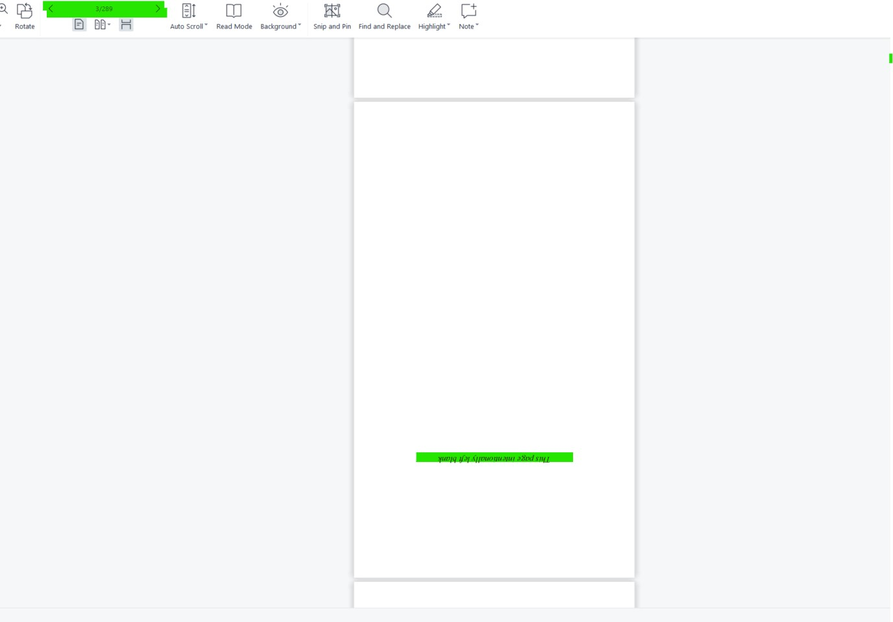
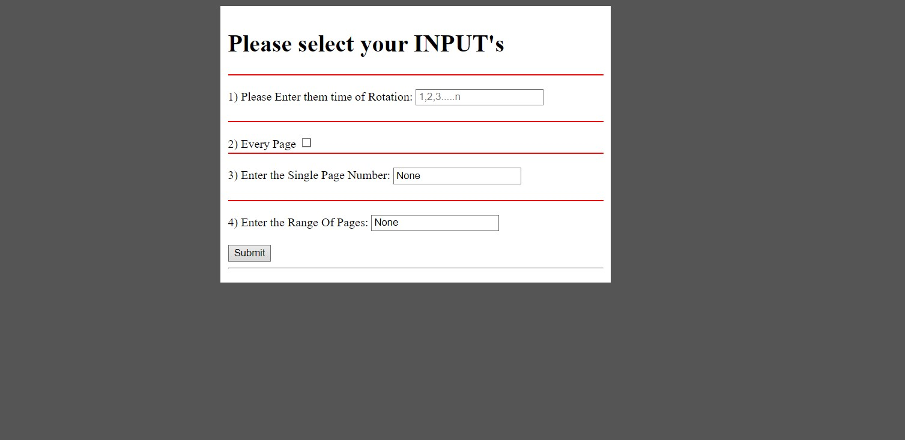

# PDF Reader
## A rest API PACKAGE FOR PDF PAGE ROTATION.

## How does it look's
<table>
  <tr>
    <td></td>
  </tr>
 </table>

<!--  -->

<table>
  <tr>
    <td>Initial Upload Look: Step-01</td>
     <td>Uploading a file: Step-02</td>
  </tr>
  <tr>
    <td></td>
    <td> </td>
  </tr>
 </table>

 <table>
  <tr>
    <td>Enter User's Input: Step-03</td>
     <td>Processing and Output as json: Step-04</td>
  </tr>
  <tr>
    <td></td>
    <td> </td>
  </tr>
 </table>

## How to use this package
STEP 1: ./init_setup.sh

STEP 2: python src/pdfReader/entity/rotationAPI.py 

## What to keep in mind
1) Times of Rotation/degrees of rotation is required
2) We have given 3 options - select Every page - select Specific page - select Range of pages
3) We can choose one of abve 3 choices